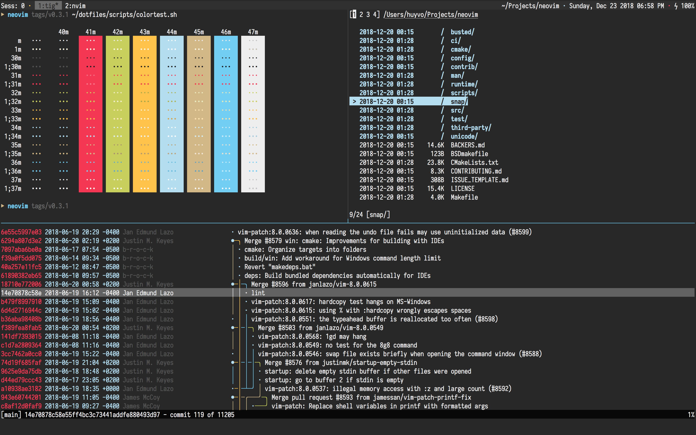
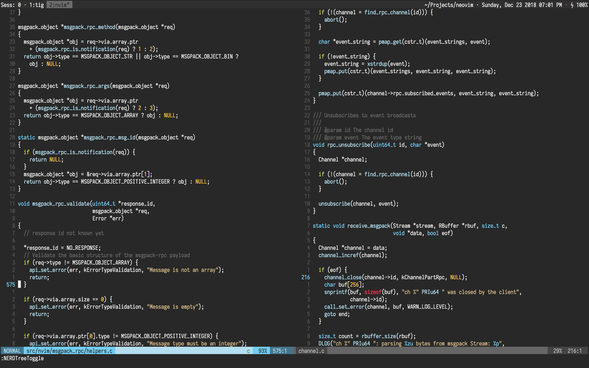

# Dotfiles are meant to be shared


## Table of Contents

  * [Prerequisites](#prerequisites)
  * [Installation](#installation)
  * [Postinstall](#postinstall)
  * [Screenshots](#screenshots)
  * [What's inside init.vim?](#whats-inside-initvim)
  * [Highlights](#highlights)
  * [Git congfig](#git-config)
  * [Iosevka](#iosevka)
  * [Inspired by](#inspired-by)
  * [License](#license)

## Prerequisites

Make sure the following requirements are installed:

<details>
<summary>Homebrew</summary>
<br>

Install [Homebrew](https://brew.sh) if you haven't.
</details>

<details>
<summary>Git</summary>
<br>

You can either install git via Xcode Command Line Tools or by running `git --version` from your terminal.
</details>

<details>
<summary>Zsh & Oh-My-Zsh</summary>
<br>

[The Z shell](https://github.com/robbyrussell/oh-my-zsh/wiki/Installing-ZSH), is an extended version of the Bourne Shell (sh), with plenty of new features, and support for plugins and themes. [Oh My Zsh](https://github.com/robbyrussell/oh-my-zsh) is a delightful community-driven framework for managing your zsh configuration.

This project use [purer](https://github.com/DFurnes/purer) as the prompt theme for zsh:

```
$ npm install --global purer-prompt
```
</details>

<details>
<summary>RVM</summary>
<br>

RVM is a command-line tool which allows you to easily install, manage, and work with multiple ruby environments from interpreters to sets of gems. Install RVM: https://rvm.io.
</details>

<details>
<summary>NVM</summary>
<br>

Node Version Manager - Simple bash script to manage multiple active node.js versions. To install nvm: https://github.com/creationix/nvm.
</details>

<details>
<summary>Neovim</summary>
<br>

[Neovim](https://github.com/neovim/neovim) (nvim) is a forked version of Vim and arguable to be a lot faster. Follow this guide to build [nvim from source](https://github.com/neovim/neovim/wiki/Building-Neovim) and this guide to install [vim-plug](https://github.com/junegunn/vim-plug) as the main nvim plugin manager.
</details>

<details>
<summary>Tmux</summary>
<br>

[Tmux](https://github.com/tmux/tmux/wiki) is the terminal multiplexer I can't live without. 
</details>

## Installation

Clone this project at `$HOME`:

```bash
$ git clone git@github.com:huyvohcmc/dotfiles.git
$ cd dotfiles
```

Use Homebrew to install some necessary packages defined in `Brewfile`:

```bash
$ brew bundle
```

Create a backup of your existing dotfiles, remove them in `$HOME` and install the new ones using [stow](https://www.gnu.org/software/stow/):

```bash
$ make stow
```

To remove dotfiles:

```bash
$ make unstow
```

## Postinstall

Open nvim and install all plugins: `:PlugInstall`. You should also run `:checkhealth` to check your nvim condition.

Install [Tmux plugin manager](https://github.com/tmux-plugins/tpm) and press `prefix` + `I` inside a tmux session to fetch the plugins listed in `.tmux.conf`.

## Screenshots

<details>
<summary>Expand</summary>
<br>


> iTerm2 tender colorscheme, nnn and tig


> Nvim with Iosevka font 14pt
</details>

## What's inside init.vim?

Visit [nvim's wiki](https://github.com/huyvohcmc/dotfiles/wiki/Nvim-plugins) for more details.

## Highlights

The `Brewfile` contains some interesting CLI tools for better development like

- `bat`, an alternative of `cat`
- `htop`, an interactive process viewer for Unix systems
- `nnn`, a very fast terminal file manager
- `wd`, jump to custom directories in zsh
- `ripgrep`, a line-oriented search tool
- `stow`, a symlink farm manager
- `the_silver_searcher`, a code searching tool (used in vim)
- `fzf`, command-line fuzzy finder
- `tig`, text-mode interface for git
- `universal-ctags`, a programming tool to generate tag files

## Git config

To prevent people from accidentally committing under your name:

```bash
# .gitconfig
[user]
  # set in ~/.gitconfig_local and included
[include]
  path = ~/.gitconfig_local
```

Where `~/.gitconfig_local` is simply:

```bash
[user]
  name = <your_name>
  email = <your_email>
```

I also use a `.gitmessage` template for co-authored commits on GitHub:

```bash
# ~/.gitmessage
Co-authored-by: Linus Torvalds <torvalds@transmeta.com>
```

## Iosevka

[Iosevka](https://github.com/be5invis/Iosevka) is one of the best font for programmers, it looks so good to the eye and supports ligatures. It also has many prebuilt variants, and if you build yourself you can customize the look of many different characters. Here is how I built an Iosevka version for my own:

1. Clone the repository
2. Ensure `nodejs` >= 8.4, `ttfautohint` and `otfcc` are installed
3. Install necessary libs by `npm install`
4. `npm run build -- contents:iosevka --design:ligset-haskell`
5. `npm run build -- contents:iosevka-term` (for term version)

Visit Iosevka's main repo for more build instructions.

## Inspired by

- [ahmedelgabri's dotfiles](https://github.com/ahmedelgabri/dotfiles)
- [thoughtbot's dotfiles](https://github.com/thoughtbot/dotfiles)
- [Mathias Bynens's dotfiles](https://github.com/mathiasbynens/dotfiles)
- [Amir Salihefendic's vimrc](https://github.com/amix/vimrc)

## License

This repository is available under the [MIT license](LICENSE). Feel free to fork and modify the dotfiles as you please.
